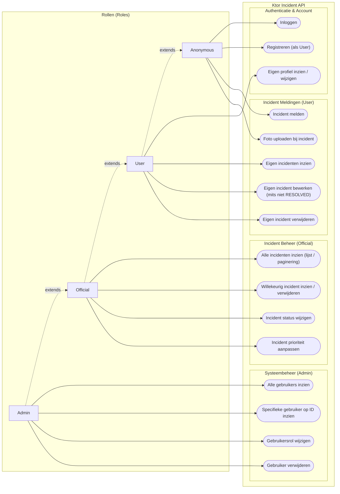

# Ontwikkeldocument - Ktor & Android Incident Demo

Dit document dient als het centrale referentie- en ontwikkeldocument voor de **Ktor & Android Incident Demo** (`ktor-android-incident-demo`). Het beschrijft de context van de casus, de doelstellingen van deze full-stack voorbeeldapplicatie, de gehanteerde moderne tooling en build-omgeving (Kotlin Toolchain / Amper), de modulaire architectuur (`server`, `shared`, `android`), de implementatie van aanbevolen Ktor-patterns (zie ook: https://github.com/nomisRev/avans-toolchain-and-ktor-2026), het gedetailleerde beveiligings- en autorisatieontwerp (RBAC & ABAC), en praktische aanwijzingen voor ontwikkelaars.

---

## 1. Inleiding & Casusbeschrijving

### 1.1 De Casus: Meldingen Openbare Ruimte
De applicatie is ontwikkeld als full-stack demonstratieproject voor het melden, registreren en opvolgen van incidenten in de leefomgeving / openbare ruimte (vergelijkbaar met systemen zoals BuitenBeter of 'Melding Openbare Ruimte' bij gemeenten). Burgers en bezoekers kunnen onregelmatigheden in hun woon- of werkomgeving eenvoudig signaleren en doorgeven aan bevoegde instanties (zoals gemeentelijke diensten, handhaving of wijkbeheer).

Typische voorbeelden van incidenten binnen deze casus zijn:
- **Milieu & Zwerfvuil**: Illegale afvaldumpingen, volle openbare afvalbakken, rondslingerend grofvuil.
- **Infrastructuur & Verkeer**: Schade aan het wegdek (kuilen, losliggende stoeptegels), defecte verkeerslichten of scheefgereden verkeersborden.
- **Openbare Verlichting & Meubilair**: Niet-werkende straatlantaarns, vernielde bushokjes of beschadigde bankjes.
- **Overlast & Veiligheid**: Graffiti, vandalisme of acute overlastsituaties.

### 1.2 Domeinmodel in vogelvlucht
Een incident (`Incident`) bevat alle relevante context om een snelle en doeltreffende afhandeling mogelijk te maken:
- **Identificatie & Tijdstempels**: Uniek ID, aanmaakdatum (`createdAt`) en tijdstip van laatste wijziging (`updatedAt`).
- **Inhoudelijke omschrijving**: Categorie (`Category`, bijv. INFRASTRUCTURE, ENVIRONMENT, TRAFFIC, CRIME), beschrijving en ernst (`Urgency`, bijv. LOW, MEDIUM, HIGH).
- **Locatie**: GPS-coördinaten (`latitude`, `longitude`) voor kaartweergave en geografische clustering.
- **Statuscyclus & Prioriteit**:
  - Statussen (`Status`): `REPORTED` &rarr; `UNDER_REVIEW` &rarr; `IN_PROGRESS` &rarr; `RESOLVED` &rarr; `CLOSED`.
  - Prioriteiten (`Priority`): `LOW`, `NORMAL`, `HIGH`, `URGENT`.
- **Melder (Resource Ownership)**: Een incident kan anoniem worden ingediend (`userId = null`) of gekoppeld zijn aan een geregistreerde burger (`userId`).
- **Media**: Eén of meerdere afbeeldingen (`IncidentImage`) die als bewijslast of toelichting worden geüpload en opgeslagen.

---

## 2. Doel van deze Voorbeeldcasus

Deze applicatie is opgezet met drie primaire educatieve, architecturale en demonstratieve doeleinden:

### 2.1 Voorbeeld voor actuele Ktor features & Full-Stack Architectuur
- **Moderne Ktor 3.x Features & Best Practices**:
  - **Programmatische `embeddedServer(Netty)` & Expliciete Dependencies**: Geen reflectie-gebaseerde `EngineMain` of "magische" discovery in HOCON; de server start deterministisch met een getypeerde `Dependencies` container.
  - **Typed Authentication API met Directe Principals**: Toepassing van de in Ktor 3.6 geïntroduceerde typed authentication API (`jwt<User>("jwt-auth")`). De domeinklasse `User` fungeert direct als principal zonder overbodige wrappers.
  - **Declaratieve Rolautorisatie**: Autorisatie via `withRoles` en `authenticateWith(roleAuth, roles = setOf(...))` met hiërarchische overerving via `Role.implied`.
  - **ContentNegotiation & Serialization**: Geautomatiseerde en type-veilige JSON-verwerking via `kotlinx.serialization` met gedeelde DTO's.
  - **Uniforme Foutafhandeling via StatusPages**: Centrale mapping van typed exceptions naar een uniforme `@Serializable data class ApiError(val message: String)` response.
  - **Observability via CallLogging**: Real-time logging van HTTP-verzoeken, statussen en doorlooptijden in het terminalvenster.
  - **HTTP Standaarden & Mobile Optimalisatie**: Ingebouwde ondersteuning voor `HEAD`-verzoeken via `AutoHeadResponse` (essentieel voor mobiele cache-validatie en beeldmetadata).
  - **Endpoint Beveiliging via Rate Limiting**: Bescherming van het inlog-endpoint tegen brute-force aanvallen via de `RateLimit` plugin (10 verzoeken per minuut).
  - **Schone Routering & Scheiding van Handlers**: Declaratieve routebomen waarin de verwerkingslogica is ondergebracht in afzonderlijke `RoutingContext` extension functies.
  - **Veilige Multipart File Uploads**: Asynchrone streaming van binaire afbeeldingsbestanden via `writeChannel()` met gegarandeerde resource release via `try ... finally { part.release() }`.
- **Full-Stack Multi-Module Architectuur**:
  - **`android`**: Native Android app (`android/app`) gebouwd met Jetpack Compose, ViewModel-architectuur, Ktor Client en Coil voor incidentfoto's (*coming soon*).
  - **`shared`**: Kotlin Multiplatform bibliotheek (`[jvm, android]`) met gedeelde domeinmodellen (`Priority`, `Status`, `Category`, `Role`), DTO's (`LoginRequest`, `IncidentResponse`, etc.) en foutmodellen (`ApiError`).
  - **`server`**: Ktor backend service (`jvm/app`) met Exposed ORM en REST API endpoints.

### 2.2 Demo van het gebruik van de Kotlin Toolchain als Build Tool
- **Vervanging van Gradle**: Dit project demonstreert het gebruik van de officiële **Kotlin Toolchain** (aangedreven door Amper) als lichtgewicht, moderne vervanger voor Gradle.
- **Eenvoudige Declaratieve Configuratie**:
  - `project.yaml`: Definieert het multi-module project (`android`, `server`, `shared`).
  - `module.yaml`: Overzichtelijke declaratieve modulespecificaties (`android/module.yaml`, `server/module.yaml`, `shared/module.yaml`).
  - `libs.versions.toml`: Centrale versiecatalogus in de hoofdmap van het project.
- **Standaard Moderne Project Layout**:
  - Geen diepe `src/main/kotlin/` nestings, maar een overzichtelijke mappenstructuur:
    - `shared/src/incident/shared/...`: Gedeelde multiplatform code.
    - `server/src/incident/server/...`: Backend bronbestanden per domein.
    - `android/src/incident/android/...`: Android applicatiecode.
    - `server/resources/`: Applicatieconfiguratie en logback-instellingen.
    - `server/test/incident/server/...`: Unittests, test assets en HTTP-requests.
- **Geen Complexe Build Scripts of Daemons**:
  - Geen zware Gradle daemons op de achtergrond.
  - Uitvoerbaar via de wrappers `./kotlin` (Linux/macOS) en `kotlin.bat` (Windows).
  - Automatische provisioning van de standaard JDK (Java 25).

### 2.3 Demo van HTTP Requests Bestanden (`.http`)
- **API Testen en Documenteren via IntelliJ IDEA HTTP Client**:
  - In de map `server/test/http-requests/` zijn kant-en-klare `.http` bestanden opgenomen die interactief in IntelliJ IDEA uitgevoerd kunnen worden (via het groene 'Run'-icoon naast elk verzoek):
    - `anonymous-flow.http`: Demonstreert het anoniem indienen van een incident en het valideren van publieke toegang.
    - `new-user-flow.http`: Volgt het volledige registratieproces van een nieuwe burger, inloggen, automatische tokenextractie, bijwerken van profielgegevens, melden van incidenten en het uploaden van meerdere foto's.
    - `existing-user-henk-flow.http`: Scenario voor een bestaande melder (Henk) die eigen incidenten ophaalt en bijwerkt.
    - `official-flow.http`: Scenario voor een ambtenaar (Sophie/Ron) met toegang tot alle incidenten, meldercontactgegevens en het muteren van status en prioriteit.
    - `admin-flow.http`: Beheerdersscenario met overzicht van alle accounts, inspectie van individuele gebruikers, rolwijzigingen en accountverwijdering.
- **Voordelen voor Ontwikkeling**:
  - **In-repo beheer**: Geen externe tools zoals Postman nodig; alle aanroepen staan direct in Git.
  - **Geautomatiseerde token-opslag**: JWT-tokens worden na inloggen direct automatisch opgeslagen via response handler scripts (`client.global.set("newUserToken", response.body.token)`).
  - **Directe feedback**: Statuscodes, headers en JSON-response bodies zijn direct zichtbaar in de IDE.

---

## 3. Architectuur en Aanvullende Ontwikkelinformatie

### 3.1 Gelaagde Architectuur per Domein
Het project volgt een schone, gelaagde architectuur georganiseerd per domein met expliciete dependency injection via `Dependencies.kt`:
- **`incident.server.auth`**: Authenticatie, JWT-token creatie, verificatie en authenticatieschema's (`JwtService`, `AuthRoutes`, `AuthModule`).
- **`incident.server.users`**: Gebruikersbeheer, services, datalaag en routes (`UserService`, `UserRepository`, `ExposedUserRepository`, `UserRoutes`, `UsersModule`).
- **`incident.server.incidents`**: Incidentregistratie, status- en prioriteitswijzigingen, multipart foto-uploads en geografische coördinaten (`IncidentService`, `IncidentRepository`, `ExposedIncidentRepository`, `IncidentRoutes`, `IncidentsModule`).
- **`incident.server.core`**: Generieke repositories (`CrudRepository`), database-initialisatie (`DatabaseFactory`) en data-seeding (`seedDemoData`).
- **`incident.server.plugins`**: Centrale status- en exception-handlers (`StatusPages.kt`).
- **`incident.server.utils`**: Extension functies voor `ApplicationCall` (o.a. `userId()`, `userRole()`, `isQualifiedOfficial()`).
- **`incident.server.Dependencies`**: Getypeerde container (`Dependencies`) die alle services en autorisatieschema's bundelt voor `Application.module(dependencies)`.

### 3.2 Datalaag & Persistentie met JetBrains Exposed
- **ORM & Tabellen**: Database-toegang is geïmplementeerd met **JetBrains Exposed** (`org.jetbrains.exposed.v1`). Tabellen zijn declaratief gedefinieerd in `UsersTable`, `IncidentsTable` en `IncidentImagesTable`.
- **Database Keuze (`DatabaseFactory.kt`)**:
  - **In-Memory H2 (standaard)**: `jdbc:h2:mem:incidents;DB_CLOSE_DELAY=-1`. Ideaal voor snelle lokale tests en demonstraties; elke herstart begint met een schone lei.
  - **Bestand-gebaseerde H2**: `jdbc:h2:file:./data/incidents;AUTO_SERVER=TRUE`. Behoudt data tussen herstarts door simpelweg de bestands-URL mee te geven aan `DatabaseFactory.init()`.
  - **PostgreSQL**: Eenvoudig in te stellen voor productie door de PostgreSQL driver toe te voegen en de connection URL aan te passen.
- **Idempotent Seeding (`seedDemoData`)**:
  - Bij het opstarten van de applicatie in `main()` worden automatisch demonstratie-gebruikers en incidenten geladen indien de database nog leeg is (vóórdat de HTTP-server start).
  - **Standaard testaccounts**:
    - `admin` (wachtwoord: `password`) &rarr; Rol: **ADMIN**
    - `Sophie`, `Ron` (wachtwoord: `pwd`) &rarr; Rol: **OFFICIAL**
    - `Henk`, `Anne`, `Kees`, `Bram`, `Fatima`, `Lotte` (wachtwoord: `pwd`) &rarr; Rol: **USER**

### 3.3 Afbeeldingen en Multipart Uploads
- Foto's bij incidenten worden via een `multipart/form-data` verzoek verzonden naar `POST /api/incidents/{id}/images`.
- Conform ([slides 60–64](https://nomisrev.github.io/ktor-fundamentals/#/60)) worden inkomende bestanden asynchroon gestreamd naar schijf (`part.provider().copyAndClose(destinationFile.writeChannel())`).
- Resource-vrijgave is gegarandeerd doordat elk part-element wordt verwerkt in een `try ... finally { part.release() }` blok, zodat buffers en kanalen ook bij netwerkonderbrekingen direct worden opgeruimd.
- De bestanden worden opgeslagen in `uploads/incident-images/` met een veilige, server-gegenereerde bestandsnaam (`incident{id}-image{num}.{ext}`) na validatie van de bestandsextensie (`jpg`, `jpeg`, `png`, `webp`).
- De bestanden zijn vervolgens publiek te bekijken via `GET /api/incidents/images/{file}`.
- Bij het verwijderen van een incident (`DELETE /api/incidents/{id}`) worden de bijbehorende afbeeldingsbestanden netjes van de schijf opgeruimd.

### 3.4 Teststrategie & Ktor `testApplication`
- Geautomatiseerde unittests en integratietests bevinden zich in `server/test/incident/server/`.
- Gebruik van `io.ktor.server.testing.testApplication` voor snelle in-memory HTTP-tests zonder socket-binding.
- **Gedeelde Productie Module**: Tests roepen direct `application { module(testDependencies()) }` aan. Hierdoor testen alle suites exact dezelfde routing-, plugin- en validatielogica als in productie, met geïsoleerde fakes (`FakeUserRepository`, `FakeIncidentRepository`).
- **Type-Veilige Client Asserties**: Verzoeken en antwoorden verlopen via `createJsonClient()` met `ContentNegotiation`, waarbij getypeerde DTO's (`LoginRequest`, `IncidentResponse`, etc.) worden verzonden en ontvangen in plaats van losse JSON-strings.
- **`bearerAuth()` Helper**: Authenticatietokens worden direct via Ktor Client's `bearerAuth(token)` geplaatst.
- Alle 28 integratietests zijn direct uitvoerbaar via de CLI met `.\kotlin.bat test` (Windows) of `./kotlin test` (macOS/Linux).

---

## 4. Rollen Definiëren (RBAC)

De applicatie hanteert het principe van *least privilege*. Binnen de API worden vier niveaus van toegang onderscheiden. In de multiplatform module (`incident.shared.users.Role`) is het enum `Role { USER, OFFICIAL, ADMIN }` vastgelegd. Omdat `shared` gecompileerd wordt voor zowel JVM als Android (waar geen server-afhankelijkheden gewenst zijn), implementeert `Role` zelf geen server-interfaces. In de server-module (`incident.server.auth.JwtService.kt`) wordt de lichte `@JvmInline value class AuthRole(val role: Role) : AuthenticationRole` gebruikt als adapter naar Ktor's rol-SPI. Ongeauthenticeerde verzoeken worden behandeld als `Anonymous`.

### Rollen hiërarchie (`Role.implied`)

De rollen zijn hiërarchisch: een hogere rol *impliceert* alle lagere rollen. Dit is vastgelegd in de property `Role.implied`, die de verzameling van alle geïmpliceerde rollen (inclusief de rol zelf) teruggeeft:

```kotlin
enum class Role {
    USER,
    OFFICIAL,
    ADMIN;

    /** All roles this role implies, including itself. */
    val implied: Set<Role>
        get() = entries.filter { it.ordinal <= ordinal }.toSet()
}
```

| Rol van de gebruiker | `implied`                 |
|:---------------------|:--------------------------|
| `USER`               | `{USER}`                  |
| `OFFICIAL`           | `{USER, OFFICIAL}`        |
| `ADMIN`              | `{USER, OFFICIAL, ADMIN}` |

Hierdoor hoeft een route die voor ambtenaren bedoeld is alleen `AuthRole(Role.OFFICIAL)` te vereisen; een `ADMIN` voldoet daar dankzij `implied` automatisch aan onder Ktor's `containsAll` evaluatie. De volgorde van de enum-waarden bepaalt dus de hiërarchie.

| Rol           | Type                       | Omschrijving                                                                | Rechtenniveau                                                                                                                                                                                                                          |
|:--------------|:---------------------------|:----------------------------------------------------------------------------|:---------------------------------------------------------------------------------------------------------------------------------------------------------------------------------------------------------------------------------------|
| **Anonymous** | Niet-ingelogd              | Een willekeurige burger of gast zonder JWT token.                           | Kan inloggen, een account registreren, publieke statische afbeeldingen opvragen en laagdrempelig anoniem incidenten melden (inclusief foto's uploaden). Heeft geen toegang tot historiek of beheer.                                    |
| **User**      | Ingelogd (`Role.USER`)     | Een geregistreerde burger of melder met een geldig JWT token.               | Kan het eigen profiel beheren en incidenten melden die gekoppeld worden aan diens `userId`. Mag uitsluitend de eigen gemelde incidenten inzien, bewerken (mits nog niet afgehandeld) of verwijderen.                                   |
| **Official**  | Ingelogd (`Role.OFFICIAL`) | Een ambtenaar, behandelaar of hulpdienstmedewerker (`isQualifiedOfficial`). | Mag alle gemelde incidenten inzien en doorzoeken. Is bevoegd om de status (`status`) en prioriteit (`priority`) van incidenten aan te passen. Contactgegevens van melders worden direct meegeleverd bij het opvragen van een incident. |
| **Admin**     | Ingelogd (`Role.ADMIN`)    | Systeembeheerder met volledige controle over de API en gebruikers.          | Beschikt over alle rechten van een `Official`, aangevuld met gebruikersbeheer: alle gebruikers opvragen, specifieke gebruikersprofielen opvragen, gebruikersrollen wijzigen en gebruikersaccounts verwijderen.                         |

---

## 5. Use Case Diagram

### Legenda Rollen (Engels / Nederlands)

| Role (English) | Rol (Nederlands)                  | Toelichting / Rechten                                                                      |
|:---------------|:----------------------------------|:-------------------------------------------------------------------------------------------|
| **Anonymous**  | Anonieme bezoeker / Gast          | Publieke toegang; laagdrempelig incident melden en account registreren.                    |
| **User**       | Geregistreerde burger / gebruiker | Eigen profiel en eigen gemelde incidenten beheren.                                         |
| **Official**   | Ambtenaar / behandelaar           | Alle incidenten inzien, status en prioriteit wijzigen; ziet meldergegevens bij incidenten. |
| **Admin**      | Systeembeheerder                  | Volledige rechten inclusief gebruikersbeheer (inzien, rol wijzigen, verwijderen).          |

### PlantUML Specificatie

De formele use case-specificatie is opgeslagen als een los PlantUML-bronbestand:
👉 **[`docs/puml/use-case-diagram.puml`](puml/use-case-diagram.puml)**

Omdat PlantUML in standaard Markdown-viewers (zoals GitHub) niet direct als grafische afbeelding zichtbaar is, wordt de broncode niet inline getoond, maar via bovenstaande verwijzing beschikbaar gesteld. Dit bestand kan direct worden geopend en visueel bewerkt in IntelliJ IDEA (met de PlantUML-plugin) of geëxporteerd worden naar PNG/SVG.


### Use case Diagram (mermaid)



---

## 6. Permissiematrix (RBAC & Resource Ownership)

In de Ktor Incident API wordt autorisatie op twee niveaus gecombineerd:
1. **Role-Based Access Control (RBAC)**: Mag de rol van de aanroeper het endpoint in principe gebruiken? Dit wordt declaratief op routeniveau afgedwongen via `authenticateWith(roleAuth, roles = setOf(...))` (zie hoofdstuk 7).
2. **Resource Ownership (ABAC)**: Is de ingelogde gebruiker de eigenaar van het specifieke object? (`foundIncident.isReportedByCurrentUser(userId)` of `foundUser.id == call.userId()`).

| Resource     | CRUD / Actie                | HTTP Endpoint                        | Anonymous |   User   | Official | Admin | Voorwaarden & Logica                                                                                               |
|:-------------|:----------------------------|:-------------------------------------|:---------:|:--------:|:--------:|:-----:|:-------------------------------------------------------------------------------------------------------------------|
| **Auth**     | Inloggen                    | `POST /api/auth/login`               |    ✅     |    ✅    |    ✅    |  ✅   | Valideert credentials en retourneert JWT token                                                                     |
| **User**     | Registreren                 | `POST /api/users/register`           |    ✅     |    ❌    |    ❌    |  ❌   | Registreert nieuw account; krijgt altijd `Role.USER`                                                               |
| **User**     | Eigen profiel inzien        | `GET /api/users/me`                  |    ❌     |    ✅    |    ✅    |  ✅   | Haalt data op basis van `call.principal`                                                                           |
| **User**     | Eigen profiel wijzigen      | `PUT /api/users/me`                  |    ❌     |    ✅    |    ✅    |  ✅   | Wachtwoord, e-mail, avatar; rol kan niet zelf gewijzigd worden                                                     |
| **User**     | Alle gebruikers ophalen     | `GET /api/users`                     |    ❌     |    ❌    |    ❌    |  ✅   | Route in `authenticateWith(roleAuth, roles = setOf(Role.ADMIN))`                                                   |
| **User**     | Gebruiker op ID inzien      | `GET /api/users/{id}`                |    ❌     |    ❌    |    ❌    |  ✅   | Route in `authenticateWith(roleAuth, roles = setOf(Role.ADMIN))`                                                   |
| **User**     | Rol wijzigen                | `PUT /api/users/{id}/role`           |    ❌     |    ❌    |    ❌    |  ✅   | Route in `authenticateWith(roleAuth, roles = setOf(Role.ADMIN))`                                                   |
| **User**     | Gebruiker verwijderen       | `DELETE /api/users/{id}`             |    ❌     |    ❌    |    ❌    |  ✅   | Route in `authenticateWith(roleAuth, roles = setOf(Role.ADMIN))`                                                   |
| **Incident** | Incident melden             | `POST /api/incidents`                |    ✅     |    ✅    |    ✅    |  ✅   | `authenticateWithOptional`: koppelt `userId` indien ingelogd                                                       |
| **Incident** | Afbeelding uploaden         | `POST /api/incidents/{id}/images`    |    ✅     |    ✅    |    ✅    |  ✅   | Multipart/form-data gekoppeld aan `incidentId`                                                                     |
| **Incident** | Eigen incidenten ophalen    | `GET /api/incidents/my-incidents`    |    ❌     |    ✅    |    ✅    |  ✅   | Filtert op `userId == principal.user.id`                                                                           |
| **Incident** | Incidenten van gebruiker    | `GET /api/users/{id}/incidents`      |    ❌     | ⚠️ Eigen |    ✅    |  ✅   | Toegankelijk voor eigenaar (`id == userId`) of Official/Admin                                                      |
| **Incident** | Alle incidenten ophalen     | `GET /api/incidents`                 |    ❌     |    ❌    |    ✅    |  ✅   | Route in `authenticateWith(roleAuth, roles = setOf(Role.OFFICIAL))`                                                |
| **Incident** | Incidenten gepagineerd      | `GET /api/incidents/paginated`       |    ❌     |    ❌    |    ✅    |  ✅   | Query parameters `page` en `pageSize`; route in `authenticateWith(roleAuth, roles = setOf(Role.OFFICIAL))`         |
| **Incident** | Incident op ID opvragen     | `GET /api/incidents/{id}`            |    ❌     | ⚠️ Eigen |    ✅    |  ✅   | Eigenaar of Official/Admin (inclusief geneste `reporter`-contactgegevens); bij ongeautoriseerde `User` volgt `404` |
| **Incident** | Incident bijwerken          | `PUT /api/incidents/{id}`            |    ❌     | ⚠️ Eigen |    ✅    |  ✅   | Alleen als `!foundIncident.isResolved` én (eigenaar of Official/Admin), anders `403`                               |
| **Incident** | Status wijzigen             | `PATCH /api/incidents/{id}/status`   |    ❌     |    ❌    |    ✅    |  ✅   | Route in `authenticateWith(roleAuth, roles = setOf(Role.OFFICIAL))`                                                |
| **Incident** | Prioriteit wijzigen         | `PATCH /api/incidents/{id}/priority` |    ❌     |    ❌    |    ✅    |  ✅   | Route in `authenticateWith(roleAuth, roles = setOf(Role.OFFICIAL))`                                                |
| **Incident** | Incident verwijderen        | `DELETE /api/incidents/{id}`         |    ❌     | ⚠️ Eigen |    ✅    |  ✅   | Eigenaar of Official/Admin; verwijdert ook bijbehorende afbeeldingen                                               |
| **Uploads**  | Statische afbeelding inzien | `GET /uploads/{file}`                |    ✅     |    ✅    |    ✅    |  ✅   | Publiek toegankelijk via static content routing                                                                    |

*Legenda:*
- ✅ = Volledig toegestaan.
- ❌ = Niet toegestaan (resulteert in `401 Unauthorized` of `403 Forbidden`).
- ⚠️ Eigen = Alleen toegestaan wanneer de resource eigendom is van de aanvrager (`isReportedByCurrentUser(userId)` of `user.id == userId`).

---

## 7. Ktor Beveiligingsarchitectuur & Foutafhandeling

### 7.1 Typed Authentication Scheme met rollen (`JwtService.kt`)
De beveiliging is gebouwd op de *typed authentication API* van Ktor 3.6+. In `JwtService.kt` wordt het JWT-schema direct gekoppeld aan het domeinmodel `User`, waardoor er geen tussenliggende `UserPrincipal` wrapper meer nodig is. Binnen route-handlers is de ingelogde gebruiker rechtstreeks op te vragen via `val user: User = call.principal`:

```kotlin
typealias RoleAuthScheme =
    AuthenticationSchemeWithRoles<User, AuthRole, Unit, SimpleAuthenticationScheme<User>>

val authScheme: SimpleAuthenticationScheme<User> = jwt<User>("jwt-auth") {
    realm = jwtRealm
    verifier(jwtVerifier)
    validate { credential ->
        val id = credential.payload.getClaim("id").asLong()
        if (audienceMatches(credential) && id != null) userService.findById(id) else null
    }
}

val roleAuth: RoleAuthScheme = authScheme.withRoles(
    onForbidden = {
        call.respond(
            HttpStatusCode.Forbidden,
            ApiError("You do not have permission to access this resource.")
        )
    }
) { user ->
    user.role.implied.map { AuthRole(it) }.toSet()
}
```

De lambda bepaalt welke rollen een gebruiker *bezit*. Omdat Ktor vereist dat **alle** aan een route opgegeven rollen aanwezig zijn (`containsAll`), wordt hier de volledige set `user.role.implied` gemapt naar `AuthRole`. Zo werkt de rolhiërarchie uit hoofdstuk 4 automatisch en type-veilig door in alle routes. De typed schemes registreren zichzelf bij de applicatie zodra ze aan een route worden gekoppeld; een aparte `install(Authentication)`-stap is niet nodig. `roleAuth` wordt gebundeld in de `Dependencies` container en doorgegeven aan de route-modules.

### 7.2 Authenticatie Scopes
In de Ktor routing (`IncidentRoutes.kt` en `UserRoutes.kt`) worden endpoints onderverdeeld in:
1. **Publiek**: Geen authenticatie-wrapper (bijvoorbeeld `/api/auth/login`, `/api/users/register`, `/api/incidents/images`).
2. **Optioneel geauthenticeerd (`authenticateWithOptional(roleAuth)`)**: Voor `POST /api/incidents` en `POST /api/incidents/{id}/images`. Indien een geldig Bearer-token aanwezig is, wordt het `userId` gekoppeld; ontbreekt het token, dan wordt het verzoek als anoniem opgeslagen.
3. **Strikt geauthenticeerd (`authenticateWith(roleAuth)`)**: Vereist een valide JWT-token, ongeacht de rol. Ontbreekt het token, dan onderschept Ktor dit automatisch met een `401 Unauthorized`. Hier vallen o.a. `/my-incidents`, `/me` en de ownership-gebonden `GET`/`PUT`/`DELETE /api/incidents/{id}` onder.
4. **Rolgebonden (`authenticateWith(roleAuth, roles = setOf(...))`)**: Vereist een valide token **én** de opgegeven rol (of een rol die deze impliceert). Voldoet de gebruiker niet, dan antwoordt Ktor via `onForbidden` met `403 Forbidden`, nog vóór de route-handler wordt uitgevoerd.

Conform deze best practice van Simon Vergauwen ([slides 92–94](https://nomisrev.github.io/ktor-fundamentals/#/92)) zijn de routebomen declaratief gehouden en is de handlerlogica gescheiden in afzonderlijke `RoutingContext` extension functies:

```kotlin
// IncidentRoutes.kt – alleen OFFICIAL en (via implied) ADMIN
authenticateWith(roleAuth, roles = setOf(AuthRole(Role.OFFICIAL))) {
    get { getAllIncidents(incidentService) }
    get("/paginated") { getIncidentsPaginated(incidentService) }
    patch("/{incidentId}/priority") { updateIncidentPriority(incidentService) }
    patch("/{incidentId}/status") { updateIncidentStatus(incidentService) }
}

// UserRoutes.kt – alleen ADMIN
authenticateWith(roleAuth, roles = setOf(AuthRole(Role.ADMIN))) {
    get { getAllUsers(userService) }
    get("/{id}") { getUserById(userService) }
    put("/{id}/role") { updateUserRole(userService) }
    delete("/{id}") { deleteUser(userService, incidentService) }
}
```

Rolautorisatie is daarmee volledig declaratief: er staan geen handmatige rolcontroles meer in de route-handlers.

### 7.3 Extension Helpers (`ApplicationCallUtil.kt`)
Voor de *ownership*-controles, die niet als route-eis uit te drukken zijn, blijven enkele beknopte helpers bestaan:
- `call.userId()`: Haalt het id van de ingelogde gebruiker op (`call.principal<User>()?.id`, of `null` indien anoniem).
- `call.userRole()`: Haalt de huidige rol op (`call.principal<User>()?.role`).
- `isQualifiedOfficial()`: Geeft `true` terug indien `Role.OFFICIAL` in `userRole().implied` zit (dus voor `OFFICIAL` én `ADMIN`).

Deze worden uitsluitend gebruikt in combinatie met eigenaarschap, bijvoorbeeld:

```kotlin
val canModify = !foundIncident.isResolved
        && (isQualifiedOfficial() || foundIncident.isReportedByCurrentUser(userId))
```

### 7.4 Foutafhandeling via StatusPages (`StatusPages.kt`)
Alle fouten worden centraal getransleerd naar uniforme JSON-foutberichten via het gedeelde datamodel `@Serializable data class ApiError(val message: String)`:
- **`400 Bad Request`**: Ongeldige JSON-payloads of parameters (`BadRequestException`):
  ```json
  { "message": "Invalid request" }
  ```
- **`401 Unauthorized`**: Token ontbreekt of is ongeldig:
  ```json
  { "message": "Authentication is required to access this resource" }
  ```
- **`403 Forbidden`**: Wel ingelogd, maar ontoereikende rechten:
  ```json
  { "message": "You do not have permission to access this resource." }
  ```
- **`404 Not Found` (Preventie van Information Disclosure)**:
  Wanneer een normale `User` probeert een incident (`GET /api/incidents/{id}`) of profiel (`GET /api/users/{id}/incidents`) van een andere gebruiker op te vragen, retourneert de server opzettelijk een `404 Not Found` in plaats van een `403 Forbidden`. Hierdoor kunnen kwaadwillenden geen geldige ID's afleiden uit het verschil in statuscodes (*resource enumeration prevention*).
- **`429 Too Many Requests`**: Te veel verzoeken binnen het geconfigureerde tijdvenster:
  ```json
  { "message": "Too many requests. Please try again later." }
  ```
- **`500 Internal Server Error`**: Onverwachte serverexcepties worden gelogd via de logger en veilig gemapt naar een foutmelding zonder interne stacktraces te lekken:
  ```json
  { "message": "An unexpected error occurred." }
  ```

### 7.5 Aanvullende Ktor Plugins
- **Observability via `CallLogging`**: Alle inkomende HTTP-verzoeken worden overzichtelijk gelogd in de console (`Level.INFO`) inclusief methode, pad, HTTP-statuscode en responstijd in milliseconden.
- **HTTP Standaarden via `AutoHeadResponse`**: Handelt `HEAD`-verzoeken automatisch af voor alle geregistreerde `GET`-routes zonder de payload over het netwerk te sturen. Dit ondersteunt RFC 9110 en stelt mobiele apps (bijv. Coil op Android) in staat om snel headers (`Content-Length`, `ETag`) te controleren voor efficiënte caching.
- **Endpoint Beveiliging via `RateLimit`**: Het inlog-endpoint (`/api/auth/login`) is beveiligd tegen brute-force aanvallen met `RateLimitName("login")` (maximaal 10 pogingen per minuut).

---

## 8. Ontwikkel- en Uitvoeringsinstructies

### 8.1 Vereisten
- Een recente Java Development Kit (JDK 21 of JDK 25 aanbevolen; de Kotlin Toolchain downloadt met de huidige defaults automatisch JDK 25).
- IntelliJ IDEA 2026.2 of recenter.

### 8.2 Belangrijke CLI Commando's
De applicatie wordt beheerd via de Kotlin Toolchain wrapper:

```bash
# Project compileren en bouwen
./kotlin build          # Linux / macOS
.\kotlin.bat build      # Windows

# Alle geautomatiseerde unittests uitvoeren
./kotlin test           # Linux / macOS
.\kotlin.bat test       # Windows

# De backend server lokaal starten (luistert standaard op http://localhost:8080)
./kotlin run -m server       # Linux / macOS
.\kotlin.bat run -m server   # Windows
```

### 8.3 Uitvoeren in IntelliJ IDEA
1. Open het project direct in IntelliJ IDEA.
2. Selecteer de run configuration voor `incident.server.ApplicationKt` (of klik op het groene pijltje naast `fun main` in `server/src/incident/server/Application.kt`).
3. Zodra de console `Application - Responding at http://0.0.0.0:8080` meldt, is de API bereikbaar via `http://localhost:8080/`.
4. Open een willekeurig `.http` bestand in `server/test/http-requests/` en klik op het groene 'play'-icoon om de gewenste API-aanroepen direct interactief te testen.
